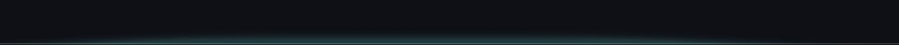
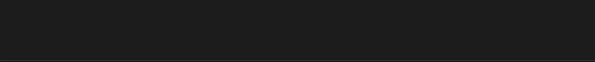

# KeyLight for macOS

[](https://www.apple.com/macos/)
[](https://www.swift.org/)
[](LICENSE)

Lightweight glow effects for your keyboard with more immersive typing, tuned for macOS. It is meant as a natural extension of your typing projected onto the bottom of your screen with cool glow effects.



## Inspiration

Hi, KeyLight was inspired by a [YouTube video](https://www.youtube.com/watch?v=esY3iS4l3Xs) by the creator HTX Studio. I wanted to have a piano-visualizer-like effect when typing. The effect best works in dark mode and with the dock set on auto-hide or when the dock is on the side of the screen.

## Why KeyLight

- Ambient typing effects for your Mac.
- Lightweight runtime designed to stay out of your way.
- Multiple styles ranging from the original glow to glass and refraction effects.
- Highly customizable colors, gradients, dimensions, roundness, fade timing, and chord behavior.
- Built-in guided and manual calibration for your keyboard and display combination.



## System Requirements

- macOS **14.0+** (Sonoma and higher)
- macOS **14.0+** for Classic Glow
- macOS **26.0+** for System Glass, Physical Refraction, and Solid Black
- Input Monitoring permission to detect key presses globally
- Screen Recording permission only if you choose Physical Refraction

Classic Glow remains available if your Mac does not support the newer effects. Classic Glow, System Glass, and Solid Black do not need Screen Recording.

## Installing KeyLight

1. Download `KeyLight-2.0.0.dmg` from the Releases page.
2. Open the DMG.
3. Drag `KeyLight.app` to Applications and replace the old version if macOS asks.
4. Launch KeyLight from Applications.

KeyLight v2.0.0 is unsigned because I am still not enrolled in the Apple Developer Program. macOS will therefore show a verification warning.

1. Try opening `KeyLight.app` once and click `Done` in the warning.
2. Open **System Settings › Privacy & Security**.
3. Scroll to the Security section and click **Open Anyway** for KeyLight.
4. Confirm **Open Anyway** once more and enter your password or use Touch ID.
5. In KeyLight's setup window, choose **Allow Input Monitoring…** and enable KeyLight.

Because this is an unsigned update, macOS may ask for Input Monitoring again. If KeyLight is enabled but does not react, remove the old KeyLight row from Input Monitoring, add `/Applications/KeyLight.app` again, and enable it.

More troubleshooting:

- [docs/TROUBLESHOOTING.md](docs/TROUBLESHOOTING.md)

## Features

- Menubar-only app
- Customizable global shortcut, with `Cmd + Shift + K` as the default
- Multiple held keys stay lit until each key is released
- Natural Merge or Independent chord appearance with adjustable intensity
- Classic Glow, System Glass, Physical Refraction, and Solid Black effects
- Solid, Position Gradient, Random Per Key, and Rainbow color modes
- Theme and keyboard-layout libraries with import and export
- Guided nine-key calibration plus the original manual key editor
- MacBook ANSI, MacBook ISO, and compact Magic Keyboard starting presets
- Main, built-in, or selected-display routing with optional additional-display mirroring
- Separate keyboard layouts bound to different displays
- Named configuration snapshots with apply, import, export, and restore
- Automatic power saving during Low Power Mode or higher thermal pressure
- Launch at login

## Keyboard Layouts and Presets

This repo includes calibrated MacBook Air 13" (2024) and MacBook Pro 14" (2024) layouts plus neutral MacBook ANSI, MacBook ISO, and compact Magic Keyboard starting profiles. The calibrated MacBook Air profile is selected by default.

- See `docs/variants/` for the bundled layouts.
- Use **Keyboard › Add Preset…** to make an editable profile from a starting point.
- Use **Keyboard › Import** and **Export** to move layout profiles.
- Use **Share Theme** and **Import Theme…** to move appearance settings.

My baseline is the **German ISO** layout of the MacBook Air 13" (2024), with guidance for US keyboard (**ANSI**) layouts. Most keys should still map 1:1 for different layouts of the same MacBook variant.

## Building

Open `KeyLight.xcodeproj` in Xcode 26 or newer and build the KeyLight scheme. The verified unsigned release package can be created with:

```bash
./scripts/build-dmg.sh --release-unsigned 2.0.0
```

Run `./scripts/build-dmg.sh` without arguments to see the other local, preview, and signed packaging modes.

## Known Issues

- Updates are manual in this unsigned release. Download newer versions from the GitHub Releases page.
- Some hardware and macOS combinations still report the media actions corresponding to F4–F9 inconsistently. An unrecognized action may use the center fallback or show no glow.
- macOS exposes Caps Lock as a state change rather than a normal key-up event. KeyLight shows a short pulse so it cannot remain stuck while Caps Lock is on.

## Privacy and License

- Privacy policy: [PRIVACY.md](PRIVACY.md)
- License: [MIT](LICENSE)
